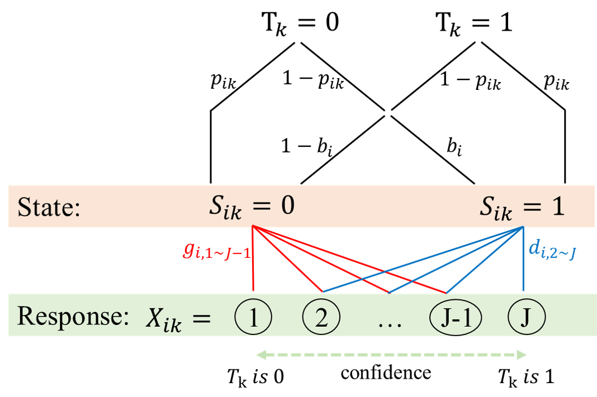

```{r, include=FALSE}
knitr::opts_chunk$set(results = 'asis',
                      echo = FALSE,
                      warning = FALSE,
                      tidy = FALSE,
                      message = FALSE,
                      fig.align = 'center',
                      out.width = "100%")
options(knitr.table.format = "html") 
```

```{r myplot, include=FALSE}
svg('myplot.svg')
plot(iris$Sepal.Length, iris$Sepal.Width)
dev.off()
```

# Introduction

Cultural consensus theory (CCT), developed by Batchelder and colleagues in the mid-1980s, is a cognitively-driven information-pooling approach to assess informants' consensus when the culturally correct answers are unknown a priori to a researcher [@Batchelder1988]. The goal of CCT is to uncover the cultural knowledge, preference, or beliefs shared by members of a group. The CCT methodology originally aims at analyzing data consisting of binary (true/false or yes/no) responses to interview questions within a culturally-related context. Later work by Batchelder and colleagues extended CCT to account for the ordinal categorical data type (e.g., the Likert-type questionnaires). In this study, we develop an alternative approach to CCT modeling for the ordinal categorical data type. Specifically, we incorporate a response-confidence embedded threshold theory into the CCT framework for assessing the consensus answers to items, item difficulty, informant knowledge, and sensory and response biases. We systematically evaluate the fit by simulation using the hierarchical Bayesian modeling approach, focusing on the issues of  parameter recovery and posterior predictive check. 
這個一定要山

## Objectives

1. Pick a template layout.
2. Write/ create your poster content distraction free.
3. Let posterdown do its thing!

# The Axiom of GLM (待改)

```{definition, name="Single Cultural Truth", label="SCT", echo=TRUE}
整組題項對於所有的受試者，都只有唯一的一組共識答案 

$$\begin{equation}
\mathbf{T} = (T_1,\dots\,T_M)^{\top} \in \{0,1\}^M.
\end{equation}$$
```

To reference a citation you can add your `.bib` file to the working directory and name it in the YAML metadata or generate an automated one as done here, then you only need to reference the label value in the `.bib` file. For example this package is built on top of the wonderful {pagedown} package and I will cite it at the end of this sentance using this in the rmd `[@R-pagedown]` [@R-pagedown].

To get a better understanding of how to include features like these please refer to the {posterdown} [wiki](https://github.com/posterdown/wiki).




# Hierarchical Bayesian Model

**Likelihood**
$$\begin{align*}
X_{ik} \sim Categorical(\mathbf{p_{X_{ik}}})
\end{align*}$$

**Prior**
$$\begin{align*}
\mathbf{p_{X_{ik}}} &= p_{S_{ik}}\mathbf{d_{i}}+(1-p_{S_{ik}})\mathbf{g_{i}}\\
p_{S_{ik}} &= (p_{ik}+(1-p_{ik})b_i)^{T_k}\times((1-p_{ik})b_i)^{1-T_k} \\
p_{ik} &= \frac{E_i(1-Q_k)}{E_i(1-Q_k)+(1-E_i)Q_k} \\
T_k &\sim Bernoulli(p_T) \\
E_i &\sim Beta(\mu_E\tau_E, (1-\mu_E)\tau_E) \\
Q_k &\sim Beta(\mu_Q\tau_Q, (1-\mu_Q)\tau_Q) \\
b_i &\sim Beta(\mu_b\tau_b, (1-\mu_b)\tau_b) \\
\mathbf{d_{i}} &\sim Dirichlet(\boldsymbol{\alpha_d}) \\
\mathbf{g_{i}} &\sim Dirichlet(\boldsymbol{\alpha_g})
\end{align*}$$

**Hyperprior**
$$\begin{align*}
p_T &\sim Uniform(0, 1) \\
\mu_E &\sim Beta(\alpha_{\mu_E}, \alpha_{\mu_E}), \quad \alpha_{\mu_E} = 1 \\
\tau_E &\sim Gamma(\mu_{\tau_E}^2/\tau_{\tau_E}^2, \mu_{\tau_E}/\tau_{\tau_E}^2), \quad \mu_{\tau_E} = 10, \quad \sigma_{\tau_E} = 10 \\
\mu_Q &\sim Beta(\alpha_{\mu_Q}, \alpha_{\mu_Q}), \quad \alpha_{\mu_Q} = 1 \\
\tau_Q &\sim Gamma(\mu_{\tau_Q}^2/\tau_{\tau_Q}^2, \mu_{\tau_Q}/\tau_{\tau_Q}^2), \quad \mu_{\tau_Q} = 10, \quad \sigma_{\tau_Q} = 10 \\
\mu_b &= 0.5 \\
\tau_b &\sim Gamma(\mu_{\tau_b}^2/\tau_{\tau_b}^2, \mu_{\tau_b}/\tau_{\tau_b}^2), \quad \mu_{\tau_b} = 30, \quad \sigma_{\tau_b} = 10 \\
\boldsymbol{\alpha_d} &= (0,1,\dots,1)^{\top} \\
\boldsymbol{\alpha_g} &= (1,\dots,1,0)^{\top} \\
\end{align*}$$

where $i = 1, \dots, N$, $k = 1, \dots, M$, $j = 1, ..., J$, and the $J\times 1$ column vector (e.g. $\mathbf{ p_{X_{ik}}}, \mathbf{d_i}, \mathbf{g_i}, \boldsymbol{\alpha_d}, \boldsymbol{\alpha_g}, \mathbf{1}$) are denoted by bold symbol.


**_Now on to the results!_**

<br>

# Results

Here you may have some figures to show off, bellow I have made a scatterplot with the infamous Iris dataset and I can even reference to the figure automatically like this, `Figure \@ref(fig:irisfigure)`, Figure \@ref(fig:irisfigure).

```{r, irisfigure, fig.cap='Here is a caption for the figure. This can be added by using the "fig.cap" option in the r code chunk options, see this [link](https://yihui.name/knitr/options/#plots) from the legend himself, [Yihui Xie](https://twitter.com/xieyihui).', out.width="80%"}
par(mar=c(2,2,0,1))
plot(x = iris$Sepal.Length, y = iris$Sepal.Width,
     col = iris$Species, pch = 19, xlab = "Sepal Length",
     ylab = "Sepal Width")
```

Maybe you want to show off some of that fancy code you spent so much time on to make that figure, well you can do that too! Just use the `echo=TRUE` option in the r code chunk options, Figure \@ref(fig:myprettycode)!

```{r myprettycode, echo=FALSE,collapse=TRUE, fig.cap='Boxplots, so hot right now!', fig.height=3.5, out.width="80%"}
#trim whitespace
par(mar=c(2,2,0,0))
#plot boxplots
boxplot(iris$Sepal.Width~iris$Species,
        col = "#008080", 
        border = "#0b4545",
        ylab = "Sepal Width (cm)",
        xlab = "Species")
```

How about a neat table of data? See, Table \@ref(tab:iristable):

```{r, iristable}
knitr::kable(
  iris[1:8,1:5], format = "html",
  caption = "A table made with the **knitr::kable** function.",
  align = "c", col.names = c("Sepal <br> Length",
                             "Sepal <br> Width",
                             "Petal <br> Length",
                             "Petal <br> Width",
                             "Species"),
  escape = FALSE)
```

# References
