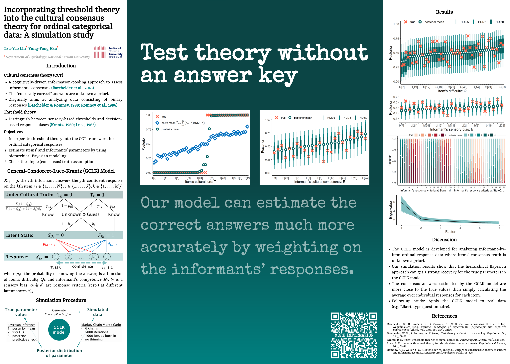

# 第八屆臺大心理系全系師生學術交流研討會壁報展

- Date: 2020/11/18 Wed.
- Location: 南館 S219
- Title：Incorporating threshold theory into the cultural consensus theory for ordinal categorical data: A simulation study
- Author：Tzu-Yao Lin, Yung-Fong Hsu
- GCLK model: <https://xup6y3ul6.github.io/GCLKmodel_poster/GCLK_HBM.html>
- Poster：<https://xup6y3ul6.github.io/GCLKmodel_poster/poster.pdf>

