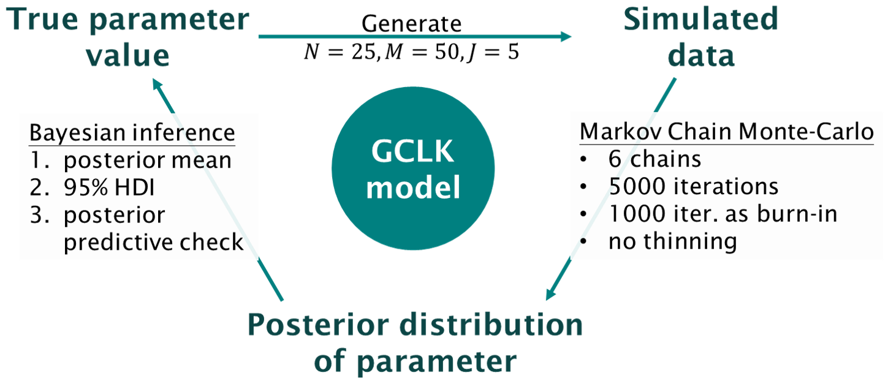
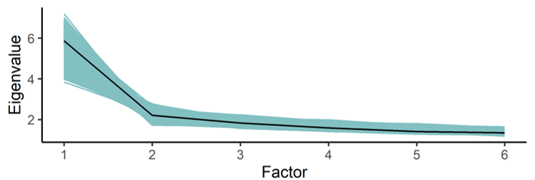

```{r, include=FALSE}
knitr::opts_chunk$set(results = 'asis',
                      echo = FALSE,
                      warning = FALSE,
                      tidy = FALSE,
                      message = FALSE,
                      fig.align = 'center',
                      out.width = "100%")
options(knitr.table.format = "html") 
```

```{r myplot, include=FALSE}
svg('myplot.svg')
plot(iris$Sepal.Length, iris$Sepal.Width)
dev.off()
```

# Introduction

## Cultural consensus theory (CCT)

- A cognitively-driven information-pooling approach to assess informants' consensus [@Batchelder2018].
- The "culturally correct" answers are unknown a priori.
- Originally aims at analyzing data consisting of binary responses [@Batchelder1988; @Romney1986].

## Threshold theory 

- Distinguish between sensory-based thresholds and decision-based response biases [@Krantz1969; @Luce1963].

## Objectives

1. Construct a new model embedded threshold theory into the CCT framework to deal with ordinal categorical responses with different confident levels.
2. Estimate items' and informants' parameters by using the hierarchical Bayesian inference.
3. Check the single (consensus) truth assumption.

# General Condorcet Luce Krantz (GCLK) Model

Consider $X_{ik} = j$ is denoted that the $i$th informant answers the $j$th confident response on the $k$th item. 

```{r out.width="99%"}
knitr::include_graphics("figures/tree.png")
```

where $p_{ik}$, the probability of knowing answer, is a function of item's difficulty $Q_k$ and informant's competence $E_i$. $b_i$ is a sensory bias and $\boldsymbol{g}_i \; \& \; \boldsymbol{d}_i$ are response criteria respectively at different latent states $S_{ik}$.

# Simulation Procedure

```{r out.width="99%"}

```

# Results

```{r out.width="99%"}
knitr::include_graphics("figures/GCLK_QBpost2.png")
knitr::include_graphics("figures/GCLK_DGpost2.png")

```

# Discussion

- The GCLK model is developed for applying informant-by-item ordinal response data where items' consensus truth is unknown a priori.
- The simulation study showed that the hierarchical Bayesian approach can get a strong recovery for the true parameters in our model and provide an method for checking single consensus answers in this data.
- The consensus answers estimated by GCLK model are more close to true value than simply calculate average over everyone responses for each item.
- Apply our proposed model to real data (e.g. Likert-type questionnaire format) for the future study.

# References
